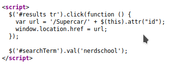

# Hint 2 - Search input for reflected XSS

Look at the source code of the page, after you have searched for something.

When querying the search field for `nerdschool`, we see that it is reflected in a jQuery method. Are you able to inject arbitrary code which becomes executable?

Try to close off the `.val`-method and inject your own code through the search query. 