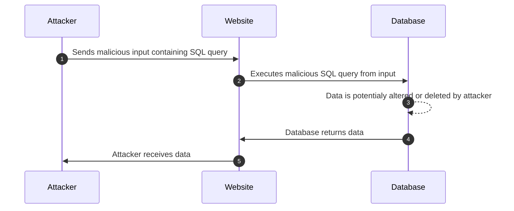

# Exercise 3 - SQL Injection

SQL Injection is a vulnerability that allows an attacker to change queries that an application makes to a SQL database. This can be done by interfering with input sent from the user, which can be interpreted by the server as valid SQL. You could replace "SQL" with any query language that is possible to input to the vulnerable application. It would still be considered an injection attack.

An attacker can retrieve data they are unauthorized to see, as well as performing destructive actions such as deleting or modifying your data.



[Read more about SQL Injection (owasp.org)](https://www.owasp.org/index.php/SQL_Injection).


---
Go to the login page (log out if you are logged in). This page has a serious sql-injection vulnerability that will allow you to login as any user. 

## 3.1  Exploiting the login form, no password

:pencil2: Try to find the SQL injection vulnerability and log in with the `user` account without providing a password. 

## 3.2 Exploiting further, different user

:pencil2: When you are logged in, look around to see if you can find the username of other people. Try to login as someone else.

# Hint

<details>
  <summary>Hint 1 for 3.1</summary>

  The underlying database is a Sqlite database.
  The code for querying the database for the correct user to login looks like this

  ```js
SELECT id FROM user WHERE username='${username}' AND password='${password}'
  ```

  See anything suspicious?

</details>

<details>
  <summary>Hint 2 for 3.1</summary>

  Find a way to send in user input that discards any WHERE-clause after the username check, so that only `.. WHERE user=<input>` is evaluated. 
</details>

<details>
  <summary>Solution for 3.1</summary>

  Set the username field to:
  ```
  user';--
  ```

  You should now be able to log in without a password. 

  Why is this happening?
  The resulting SQL statement executed in the code will look like this:

  ```javascript
  SELECT id FROM user WHERE username='user';--' AND password=''
  ```

  The part of the SQL statment after the `--` will be ignored (commented out), therefore the password value will be ignored, allowing the login form password to be ignored. The semicolon (`;`) denotes the end of one query and the start of another. The double hyphen (`--`) indicates that the rest of the current line is a comment and should be ignored.
</details>

<details>
  <summary>Hint 1 for 3.2</summary>
  Look in the comment section. Some usernames are present here.
</details>

<details>
    <summary>Hint 2 for 3.2</summary>
    Look in the voting page source code (right click anywhere on the page and select "View page source"). Something is commented out.
</details>

### [Go to exercise 5 :arrow_right:](../exercise-5/README.md)
