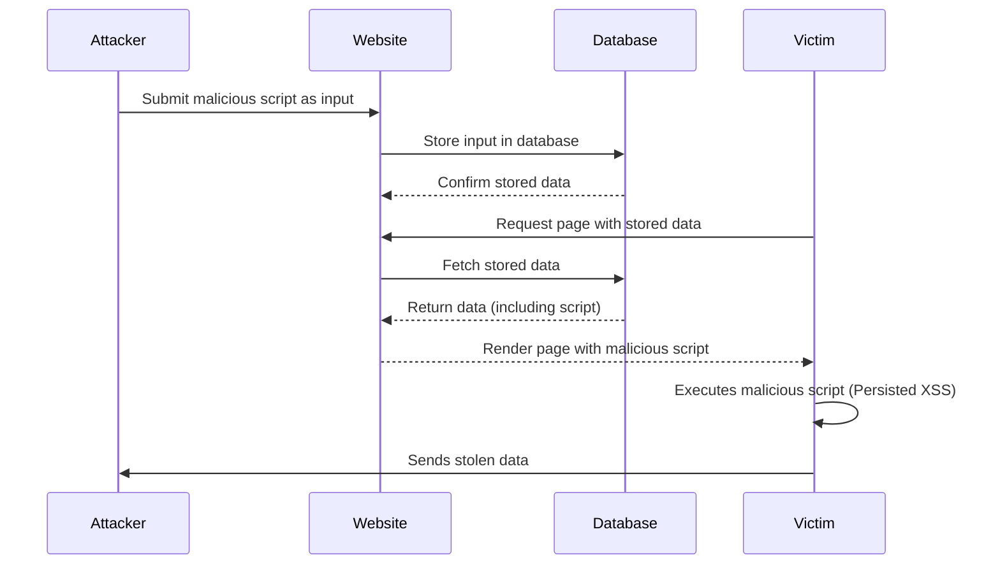

# Exercise 4 - Persisted XSS

Persisted XSS (Cross-Site Scripting) is a type of web vulnerability where an attacker injects malicious code into a website's database, which is then served to all users who access the affected page.

The main difference between persisted and reflected XSS is that in persisted XSS, the malicious code is stored in the website's database, while in reflected XSS, the code is only temporarily reflected back to the user's browser. This means that persisted XSS can affect many users over an extended period, while reflected XSS is typically limited to individual users who interact with the vulnerable webpage.

Persisted XSS attacks can be especially dangerous because they can persist over long periods of time and affect many users.



## 4.1 - Exploiting the comment section

Someone has been thoughful and added a comment section, so that there can be an open discussion about the candidates. How nice!

:pencil2: Exploit the comment field to inject some javascript code that is run on the voting page.

<details>
  <summary>Hint</summary>

  Try using the following comment as a starting point:

  ```html
<script>alert("Hacked!")</script>
  ```

</details>

:question: What are the consequences of a persisted XSS vulnerability in a part of our application that is available for multiple users?

### [Go to exercise 5 :arrow_right:](../exercise-5/README.md)
