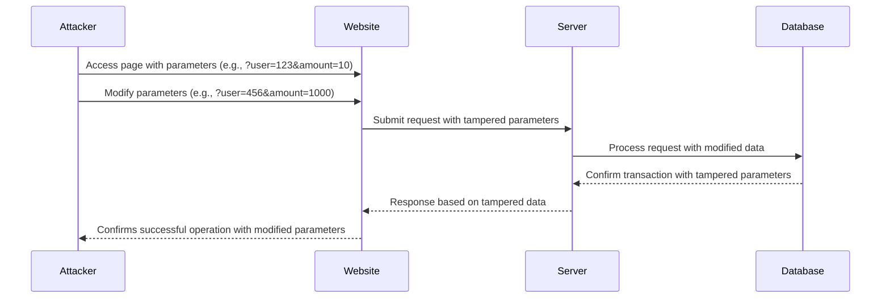

# Exercise 5 - Parameter tampering and XSS

Parameter tampering is a type of web vulnerability where an attacker modifies input parameters in a URL or form submission to gain unauthorized access or perform malicious actions on a web application.

By altering parameters such as account numbers, transaction amounts, or user IDs, an attacker can manipulate the application to perform actions that were not intended by the application's designers, such as accessing other users' data or bypassing authentication checks.

Combined with persistent XSS, and attacker can subtly change the websites behavior and rewrite URLs on the fly.

Parameter tampering attacks can be prevented by implementing strong input validation and using secure encryption and authentication measures.



## 5.1 - Tampering with the comment field

:pencil2: Open your browsers inspector and look at the comment form. Tamper with parameters, and try to submit a comment on behalf of someone else.

<details>
  <summary>Hint 1</summary>

  Try looking at the comment form markup to see if you can identify a way to control what user is voting.
</details>

<details>
  <summary>Solution</summary>

  Open Chrome Dev Tools and use the Elements tab to edit the userId input field in the comment form.
</details>

## 5.2 - How to rig an election

:pencil2: Try to exploit the comment field by submitting a persistent XSS attack that forces the all users to vote for the candidate Eleanor Wheeler.

<details>
  <summary>Solution</summary>

  Submit the following markup as a comment:

  ```html
<script>window.addEventListener("DOMContentLoaded", (event) => {
  for(el of document.getElementsByName("candidateId")) { el.setAttribute("value", "2") }
});</script>
  ```

</details>

:star: Can you hide your tracks using your XSS attack, by having the script remove itself after executing the malicious vote?

### [Go to exercise 6 :arrow_right:](../exercise-6/README.md)
