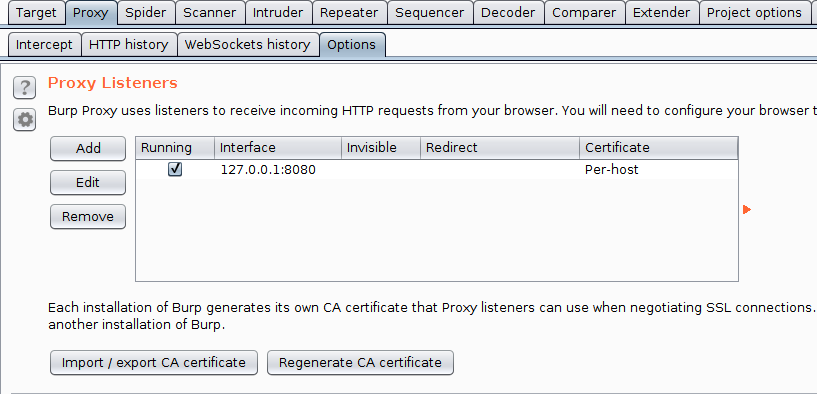
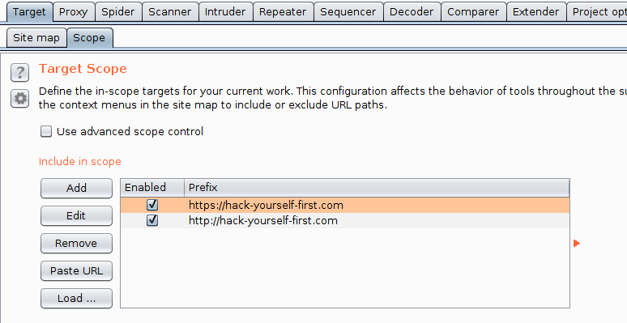
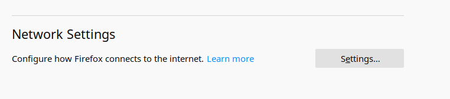
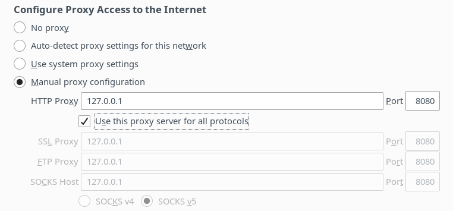

### :book: Set up a proxy using Burp Suite and Firefox
This example shows configuration of Burp Suite and Firefix for interception.

## Prerequisites
- Download and install [Burp Suite Community Edition](https://portswigger.net/burp/communitydownload).
- Download and install Firefox if you do not have it installed on your computer. 

## Steps

### Setup Burp Suite
- Run Burp Suite.
- Check that `127.0.0.1:8080` is set as a proxy listener. 

- We only want to intercept Hack-yoursself-first, so we will add the site to our target scope (Under `Target` -> `Scope`).

### Setup Firefox

- Open `Preferences` in your Firefox browser. Under `General`, at the bottom, you should fine a menu pane called `Network Settings`. 

- In the network setting menu, enable the setting `Manual Proxy Configuration`, with `127.0.0.1` as the HTTP Proxy and `8080` as the port.

The host and the IP should match that of the proxy listener in Burp Suite.
